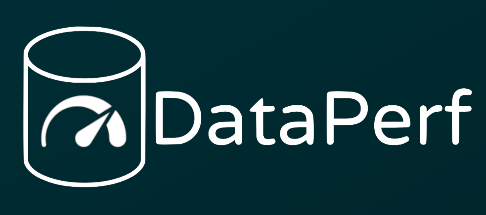

[](https://dataperf.org)

# DataPerf 

Machine learning research has long focused on models rather than datasets, and prominent datasets are used for common ML tasks without regard to the breadth, difficulty, and faithfulness of the underlying problems. Neglecting the fundamental importance of data has given rise to inaccuracy, bias, and fragility in real-world applications, and research is hindered by saturation across existing dataset benchmarks. In response, we present [DataPerf](https://dataperf.org), a community-led benchmark suite for evaluating ML datasets and data-centric algorithms. 

We aim to foster innovation in data-centric AI through competition, comparability, and reproducibility. We enable the ML community to iterate on datasets, instead of just architectures, and we provide an open, online platform with multiple rounds of challenges to support this iterative development. The first iteration of DataPerf contains five benchmarks covering a wide spectrum of data-centric techniques, tasks, and modalities in vision, speech, acquisition, debugging, and diffusion prompting, and we support hosting new contributed benchmarks from the community. The benchmarks, online evaluation platform, and baseline implementations are open source, and [the MLCommons Association](https://mlcommons.org/en/groups/research-dataperf/) will maintain DataPerf to ensure long-term benefits to academia and industry.

For more details, please see our paper: 

**DataPerf: Benchmarks for Data-Centric AI Development**, https://arxiv.org/abs/2207.10062

# Contributing to the DataPerf Benchmark Suite

If you have a data-centric benchmark you'd like to host as a challenge in our suite, we welcome contributions! To propose your own challenge and benchmark, go to https://dataperf.org to submit a proposal using our template, and join the [DataPerf Working Group](https://mlcommons.org/en/groups/research-dataperf/) to discuss with the Working Group Chairs.

# DataPerf 2023 Challenges

Below is a brief description of each challenge in our inaugural suite of benchmarks. 

## Speech Selection

[Dataperf-Selection-Speech](https://www.dataperf.org/training-set-selection-speech) is a challenge hosted by [DataPerf.org](https://dataperf.org) that measures the performance of dataset selection algorithms. The model training component is frozen and participants can only improve the accuracy by selecting the best training set. The benchmark is intended to encompass the tasks of dataset cleaning and coreset selection for a keyword spotting application. As a participant, you will submit your proposed list of training samples to the leaderboard on [DynaBench](https://dynabench.org/tasks/speech-selection) where the model is trained, evaluated, and scored.

<a href="https://colab.research.google.com/github/harvard-edge/dataperf-speech-example/blob/main/dataperf_speech_colab.ipynb"></a>
Launch [our introductory notebook on Google Colab](https://colab.research.google.com/github/harvard-edge/dataperf-speech-example/blob/main/dataperf_speech_colab.ipynb) which walks through performing coreset selection with our [baseline algorithm](https://github.com/harvard-edge/dataperf-speech-example/blob/main/selection/implementations/baseline_selection.py) and running [our evaluation script](https://github.com/harvard-edge/dataperf-speech-example/blob/main/eval.py) on the coresets for English, Portuguese, and Indonesian.

For full documentation, see [the speech selection readme](https://github.com/harvard-edge/dataperf-speech-example/blob/main/README.md).

## Vision Selection

This challenge invites participants to design novel data-centric approaches towards data selection for training of image classifiers. The image classification task will be binary classification of visual concepts (e.g. “Monster truck”, “Jean jacket”, etc) of unlabeled images. Familiar examples of similar models in production include automated labeling services by Amazon Rekognition, Google Cloud Vision API and Azure Cognitive Services.

In this challenge, your task will be to design a data selection strategy that chooses the best training examples from a candidate pool of training images (a custom subset of the Open Images Dataset V6 train set) which maximizes the mean average precision (mAP) across a set of visual concepts (e.g., “Cupcake”, “Hawk”, “Sushi”).

Successful approaches will aid in enabling image classification of long-tail concepts at scale where discovery of high-value data points is critical, in a major step towards the democratization of computer vision applications. This challenge is part of a larger effort to emphasize data-centric approaches to machine learning. The current challenge is the first one for visual data in a series of challenges on improving training and testing datasets.


For full documentation, see [the vision selection readme](https://github.com/CoactiveAI/dataperf-vision-selection/blob/main/README.md).

## Vision Debugging

When dealing with massive datasets, noises in the datasets become inevitable. This is increasingly the problem for ML training and noises in the dataset can come from many places:

* Natural noises come in during data acquisition.
* Algorithmic labeling: e.g., weak supervision, and automatically generated labels by machines.
* Data collection biases (e.g., biased hiring decisions).

If trained over these noisy datasets, ML models might suffer not only from lower quality, but also potential risks on other quality dimensions such as fairness. Careful data cleaning can often accommodate this, however, it can be a very expensive process if we need to investigate and clean all examples. By using a more data-centric approach we hope to direct human attention and the cleaning efforts toward data examples that matter more to the improvement of ML models.

In this data cleaning challenge, we invite participants to design and experiment data-centric approaches towards strategic data cleaning for training sets of an image classification model. As a participant, you will be asked to rank the samples in the entire training set, and then we will clean them one by one and evaluate the performance of the model after each fix. The earlier it reached a high enough accuracy, the better your rank is.

For full documentation, see [the vision debugging readme](https://github.com/DS3Lab/dataperf-vision-debugging/blob/main/README.md).

## Data Acquisition

An increasingly large amount of data is purchased for AI-enabled data science applications. How to select the right set of datasets for AI tasks of interest is an important decision that has, however, received limited attention. A naive approach is to acquire all available datasets and then select which ones to use empirically. This requires expensive human supervision and incurs prohibitively high costs, posing unique challenges to budget-limited users.

How can one decide which datasets to acquire before actually purchasing the data to optimize the performance quality of an ML model? In the DAM (Data-Acquisition-for-Machine-learning) benchmark, the participants are asked to tackle the aforementioned problem. Participants need to provide a data purchase strategy for a data buyer in K (=5 in the beta version) separate data marketplaces. In each data marketplace, there are a few data sellers offering datasets for sale, and one data buyer interested in acquiring some of those datasets to train an ML model. The seller provides a pricing function that depends on the number of purchased samples. The buyer first decides how many data points to purchase from each seller given a data acquisition budget b. Then those data points are compiled into one dataset to train an ML model f(). The buyer also has a dataset Db to evaluate the performance of the trained model. Similar to real-world data marketplaces, the buyer can observe no sellers’ datasets but some summary information from the sellers.

For full documentation, see [the data acquisition readme](https://github.com/facebookresearch/Data_Acquisition_for_ML_Benchmark/blob/main/README.md).

## Adversarial Nibbler

Adversarial Nibbler is a data-centric competition that aims to collect a large and diverse set of insightful examples of novel and long tail failure modes of text-to-image models that zeros in on cases that are the most challenging to catch via text-prompt filtering alone and cases that have the potential to be the most harmful to non-adversarial end users. Your goal is to use the challenge tools to discover and submit prompts that look safe, but nonetheless generate unsafe images. Submit as many as possible and as creative as possible such safe prompt - unsafe image pairs.

This challenge is aimed at researchers, developers, and practitioners in the field of fairness and development of text-to-image generative AI. The interface is intentionally designed to be simple enough that researchers from non-AI/ML communities can participate. Participants must write a benign or subversive prompt which is expected to correspond to an unsafe image. The evaluation server returns several generated images using DataPerf-managed API licenses, and the participant selects an image (or none) that falls into one of our failure mode categories surrounding stereotypes, culturallyinappropriate, or ethically inappropriate generations, among others.

For full documentation, see [the Adversarial Nibbler readme](https://github.com/mlcommons/dataperf/blob/main/dataperf-adversarial-nibbler/README.md).
# Participating in the DataPerf Challenges

All challenges are hosted on https://dynabench.org/ where participants can submit solutions and see the top results of each benchmark on our leaderboards.

For local development, clone this repository and run:

```bash
git clone https://github.com/mlcommons/dataperf
cd dataperf
git submodule update --init --recursive
```

# Contributors

Mark Mazumder, Colby Banbury, Xiaozhe Yao, Bojan Karlaš, William Gaviria Rojas, Sudnya Diamos, Greg Diamos, Lynn He, Alicia Parrish, Hannah Rose Kirk, Jessica Quaye, Charvi Rastogi, Douwe Kiela, David Jurado, David Kanter, Rafael Mosquera, Juan Ciro, Lora Aroyo, Bilge Acun, Lingjiao Chen, Mehul Smriti Raje, Max Bartolo, Sabri Eyuboglu, Amirata Ghorbani, Emmett Goodman, Oana Inel, Tariq Kane, Christine R. Kirkpatrick, Tzu-Sheng Kuo, Jonas Mueller, Tristan Thrush, Joaquin Vanschoren, Margaret Warren, Adina Williams, Serena Yeung, Lilith Bat-Leah, Newsha Ardalani, Praveen Paritosh, Ce Zhang, James Zou, Carole-Jean Wu, Cody Coleman, Andrew Ng, Peter Mattson, Vijay Janapa Reddi

**Organizations**

Harvard University, ETH Zurich, Coactive.AI, Landing AI, DeepLearning.AI, Hugging Face,
MLCommons, Meta, Google, Stanford University, San Diego Supercomputer Center,
UC San Diego, Carnegie Mellon University, Cleanlab, Eindhoven University of Technology,
Institute for Human and Machine Cognition, Kaggle, Cohere, University of Oxford,
University of Zurich, University College London, Factored
